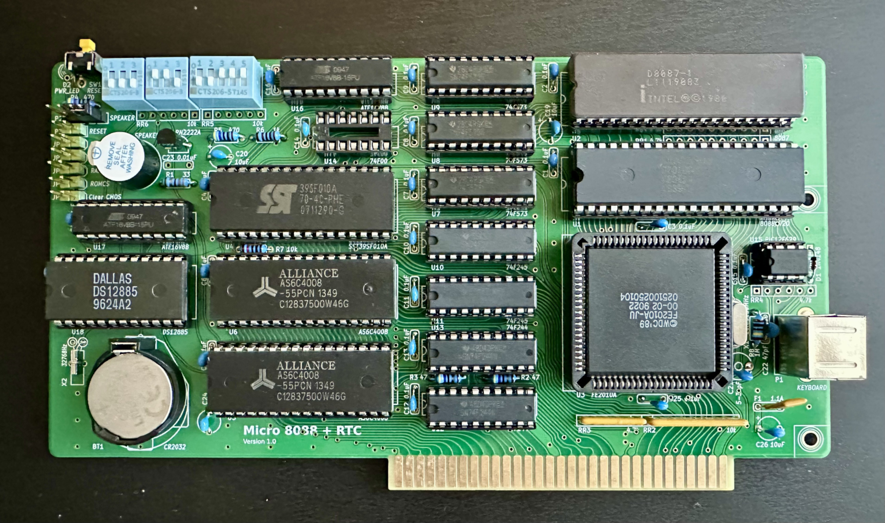

# Micro 8088 + RTC

This is an IBM XT-compatible CPU and RTC card, based on a design by [Sergey Kiselev](https://github.com/skiselev) and [Aitor Gómez García](https://github.com/spark2k06).

# The Idea

The goal of this project is to create an XT-compatible computer on a passive backplane with a modular card-based architecture, minimizing the overall footprint while providing support for all common expansion cards.

# Hardware Documentation
Schematic PDF:
[Schematic - Version 1.0](Micro_8088-RTC_Schematic.pdf)

PCB PDF:
[Board Design - Version 1.0](Micro_8088-RTC_Board_Design.pdf)

Gerber Files:
[Gerber- Version 1.0](gerber/)

SPLD:

* U16 CPU-Part:
[Use the repository provided by Sergey Kiselev](https://github.com/skiselev/micro_8088/tree/master/SPLD)

* U17 RTC-Part:
[Use the repository provided by Sergey Kiselev](https://github.com/skiselev/RTC8088/tree/main/SPLD)

AT2XT Firmware:
* U15 [minuszerodegrees.net](http://minuszerodegrees.net/at2xtkb/XTATKEY_094.zip)

# Bill of Materials

Component type    	| Reference | Description                       | Quantity 
------------------ | --------- | --------------------------------- | -------- 
PCB                |           | Micro 8080 + RTC PCB              | 1        
Integrated Circuit | U1        | Intel 8088, 80C88, or NEC V20 CPU | 1        
Integrated Circuit | U2        | Intel 8087 FPU                    | 1        
Integrated Circuit | U3        | Faraday FE2010A                   | 1        
Integrated Circuit | U4        | SST39SF010A Flash ROM, DIP-32 package | 1    
Integrated Circuit | U5, U6    | AS6C4008 SRAM, DIP-32 package     | 2        
Integrated Circuit | U7 - U9   | 74F573 Octal D-Type Latch         | 3        
Integrated Circuit | U10, U11  | 74F245 Octal Bus Transceiver      | 2        
Integrated Circuit | U12, U13  | 74F244 Octal Buffer               | 2        
Integrated Circuit | U14       | 74F00 Quad 2-Input NAND Gate      | 1        
Integrated Circuit | U15       | PIC12F629 Microcontroller         | 1        
Integrated Circuit | U16       | ATF16V8B SPLD                     | 1        
IC Socket          | U1, U2    | DIP-40, 600 mil socket            | 2        
IC Socket          | U3        | PLCC-84 through hole socket       | 1        
IC Socket          | U4-U6     | DIP-32, 600 mil socket            | 3        
IC Socket          | U7-U13, U16, U17 | DIP-20, 300 mil socket     | 9        
IC Socket          | U14       | DIP-14, 300 mil socket            | 1        
IC Socket          | U15       | DIP-8, 300 mil socket             | 1        
IC Socket          | U18       | DIP-24, 600 mil socket            | 1
Diode              | D1        | 1N4148                            | 1        
LED                | D2        | 3 mm, green LED indicator         | 1        
Transistor         | Q1        | PN2222A, 2.54mm lead spacing      | 1        
Crystal            | X1        | 28.63636 MHz, 18 pF, HC-49/S      | 1        
Crystal            | X2        | 32768Hz                           | 1
Battery            | BT1       | Battery socket                    | 1
Speaker            | SP1       | 12 mm speaker                     | 1        
Tactile Button     | SW1       | 6 mm tactile button, right angle  | 1        
DIP Switch         | SW2, SW3  | 3 positions                       | 2        
DIP Switch         | SW4       | 5 positions                       | 1        
Connector          | P1        | 6 pin Mini DIN, purple            | 1        
Pin Header         | P2        | 4 pin header, 2.54 mm pitch       | 1        
Pin Header         | P3, JP1-JP5 | 2 pin header, 2.54 mm pitch     | 6        
Capacitor          | C1 - C18  | 0.1 uF, MLCC, 5 mm lead spacing   | 19       
Capacitor          | C18 - C20 | 10 uF, MLCC, 5 mm lead spacing    | 3        
Trimmer Capacitor  | C21       | 6.5-30 pF, 5 mm lead spacing      | 1        
Capacitor          | C22       | 47 pF, MLCC, 5 mm lead spacing    | 1        
Capacitor          | C23       | 0.01 uF, MLCC, 5 mm lead spacing  | 1        
Resistor Array     | RR1       | 4.7 k, bussed, 10 pin SIP         | 1        
Resistor Array     | RR2       | 10 k, bussed, 10 pin SIP          | 1        
Resistor Array     | RR3, RR4  | 4.7 k, bussed, 6 pin SIP          | 2        
Resistor Array     | RR5, RR6  | 10 k, bussed, 6 pin SIP           | 2        
Resistor           | R1        | 33 ohm, through hole              | 1        
Resistor           | R2, R3    | 47 ohm, through hole              | 2        
Resistor           | R4, R5    | 470 ohm, through hole             | 2        
Resistor           | R6        | 1 kohm, through hole              | 1        
Resistor           | R7        | 10 kohm, through hole             | 1        
Resistor           | R8        | 1 Mohm, through hole              | 1        
Fuse               | F1        | 1.1A polyfuse, 5.08 mm lead pitch | 1        
ISA Bracket        |           | Keystone Electronics 9202         | 1        
Screw              |           | 4-40 x 1/4" Screw                 | 2        

# Release Notes

### Changes:

#### Version 1.0

 * Initial Release
 
 
# Benchmarks
 * CPU: D70108HCZ-16
 * FPU: 8087-1

### Checkit 3.0 Benchmark:
#### @4.77 MHz
 * 414 Dhrystones (1.20x)
 * 126.9K Whetstones (19.23x)

#### @7.16 MHz
 * 618 Dhrystones (1.80x)
 * 191.3K Whetstones (28.97x)

#### @9.55 MHz
 * 837 Dhrystones (2.43x)
 * 267.7K Whetstones (40.56x)

# Final Note
 * Install either U14 or U16, not both together
 * The card is tested and works.
 * This card won't fit Sergey's case ([this one](https://github.com/skiselev/micro_8088_case)). The case will need to be enlarged.
 * Card size 185.3 mm x 102.9 mm
